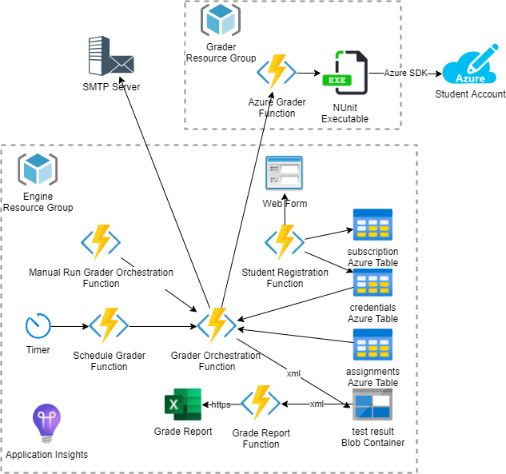

# Azure Automatic Grading Engine

For course testing Microsoft Azure, it is hard to assess or grade Azure project manually. This project makes use of the technique of unit test to grade student's Azure project settings automatically.

This project has been developed by [Cyrus Wong]( https://www.linkedin.com/in/cyruswong) [Microsoft Learn Educator Ambassador](https://docs.microsoft.com/learn/roles/educator/learn-for-educators-overview) in Association with the [Microsoft Next Generation Developer Relations Team](https://techcommunity.microsoft.com/t5/educator-developer-blog/bg-p/EducatorDeveloperBlog?WT.mc_id=academic-39457-leestott).
Project collaborators include, [Chan Yiu Leung](https://www.linkedin.com/in/hadeschan/), [So Ka Chun](https://www.linkedin.com/in/so-ka-chun-0643971a5/), [Lo Chun Hei](https://www.linkedin.com/in/chunhei-lo-86a9301b5/), [Ling Po Chu](https://www.linkedin.com/in/po-chu-ling-88392b1b5/), [Cheung Ho Shing](https://www.linkedin.com/in/cheunghoshing/) and [Pearly Law](https://www.linkedin.com/in/mei-ching-pearly-jean-law-172707171/) from the IT114115 Higher Diploma in Cloud and Data Centre Administration.

The project is being validated through usage on the course [Higher Diploma in Cloud and Data Centre Administration](https://www.vtc.edu.hk/admission/en/programme/it114115-higher-diploma-in-cloud-and-data-centre-administration/)

### Architecture

You can read more about this project at [Microsoft Educator Developer TechCommunity](https://techcommunity.microsoft.com/t5/educator-developer-blog/microsoft-azure-automatic-grading-engine/ba-p/2681809?WT.mc_id=academic-39457-leestott)

## Prerequisite

- A singe Azure Storage account with 1 Resource group and 2 containers
- Containers needed to be named. testresult and credentials with resource group name "azureautomaticgradingengine".

## ARM Deployment 

Azure Resource Manager templates (ARM templates). Is a easy way to deploy services to Azure. 

If your interested in learning more about ARM see the following Microsoft Learn Module [Deploy and manage resource manager templates] (https://docs.microsoft.com/learn/paths/deploy-manage-resource-manager-templates/) In this module you will learn about the structure of the template and the tools you will need for working with templates. If you want to learn about the benefits of using templates and why you should automate deployment with templates, see ARM template overview (https://docs.microsoft.com/azure/azure-resource-manager/templates/overview). 

## To Deploy simply click the deploy to Azure button 

Deployment URL for ARM Template 

https://portal.azure.com/#create/Microsoft.Template/uri/https%3A%2F%2Fraw.githubusercontent.com%2Fmicrosoft%2FAzureAutomaticGradingEngine%2Fmain%2Fazuredeploy.json 

## Deployment Walkthrough/demo

Please skip the setup section as the latest ARM can help you deploy eveything! but this old video teach you how to rebuild and deploy own your test.

## Config SMTP
You have to set the App Settings Key during deployment or in Azure Portal.
If you want to use gmail, you need to allow [Less Secure Apps](https://myaccount.google.com/lesssecureapps) for your gmail.

## Deploy Demo Assignment Project

This is a sample example where we can validate if students have successfully deployed a Azure VNET within a Azure Resource Group called IT114115.

As an educator you will need to provide fixed names for resources which you expect students to create within their Azure subscriptions.

In this example we expect students to create a simple VNET ARM and a resource group named IT114115
Students could use a prebuilt Azure ARM Template from the [Azure Quick Start Templates Gallery](https://azure.microsoft.com/resources/templates?WT.mc_id=academic-39456-leestott) such as the [Virtual Network Quick Create Template](https://docs.microsoft.com/azure/virtual-network/quick-create-template?WT.mc_id=academic-39456-leestott)

For the test details,
https://github.com/microsoft/AzureAutomaticGradingEngine/blob/master/AzureAutomaticGradingEngineFunctionApp/AzureGraderTest/VnetUnitTest.cs

## Supporting Environment

This service is tested with [Azure for student subscription](http://aka.ms/azure4students) and follows details in relating to the use of the [Azure SDK](https://devblogs.microsoft.com/azure-sdk/authentication-and-the-azure-sdk?WT.mc_id=academic-39456-leestott)

# How to define a Project Assignment?

## Define a project or assignment

You need to add a Entity in assignments table.
Partition Key: assignment or project name such as it114115
Properties:
"GraderUrl":  The grader HTTP Url 
"TeacherEmail":  Teacher Email for class grade report. (Optional)

# Email Registeration Link to your student.

To prevent the typo of assignment name and email address, please use mail merge to send the link to students.

You can get the sample mail merge template [/MailMerge](https://github.com/microsoft/AzureAutomaticGradingEngine/tree/main/MailMerge)

Using the template will result in your creatings and issuing a unique URL string for each student. The url string will be in the following format.

https://somethingunique.azurewebsites.net/api/StudentRegistrationFunction?project=studnetid&email=studnetemailaddress

## Student Registration Steps

1.	Login into your Azure Portal.
2.	Check your Subscription ID.
3.	Open Cloud Shell.
4.	Change your subscription
<code>az account set --subscription <your-subscriptions-id></code>
5.	Check the current subscriptions.
<code>az account show</code>
6.	Create SDK Auth, keep it privately and remenber don't run this command again.
<code>az ad sp create-for-rbac -n "gradingengine" --sdk-auth</code>
7.	Submit online registration form.

Remark: 
1. Subscription ID must be unique for each assignment.
2. Don't run <code>az ad sp create-for-rbac -n "gradingengine" --sdk-auth</code> repeatedly! Teacher needs to remove the student in subscription table and ask your student resubmits the online form for the new credentials.

## Quick test with AzureGraderConsoleRunner

Open \AzureGraderTestProject\AzureGraderConsoleRunner\Program.cs and change.

Environment.SetEnvironmentVariable("AzureAuthFilePath", @"C:\Users\developer\Documents\azureauth.json");

Build and run AzureGraderConsoleRunner.

Test result will be saved in \AzureGraderTestProject\AzureGraderConsoleRunner\bin\Debug\test_result.xml

## Run with Visual Studio Test Explorer

Set up 2 system wide environment variables

set AzureAuthFilePath=C:\Users\developer\Documents\azureauth.json

Or update \repos\AzureGraderTestProject\AzureGraderTestProject\Config.cs

## Scheduler Grader

The scheduler is set to runs every 12 hours by default and you can change the TimerTrigger expression.
https://github.com/microsoft/AzureAutomaticGradingEngine/blob/master/AzureAutomaticGradingEngineFunctionApp/ScheduleGraderFunction.cs 

testresult: saves Nunit xml test result.

## Generate the Prebuilt package

Get the latest zip package
AzureAutomaticGradingEngine\AzureAutomaticGradingEngineFunctionApp\obj\Release\netcoreapp3.1\PubTmp 

## Contributing

This project welcomes contributions and suggestions.  Most contributions require you to agree to a
Contributor License Agreement (CLA) declaring that you have the right to, and actually do, grant us
the rights to use your contribution. For details, visit https://cla.opensource.microsoft.com.

When you submit a pull request, a CLA bot will automatically determine whether you need to provide
a CLA and decorate the PR appropriately (e.g., status check, comment). Simply follow the instructions
provided by the bot. You will only need to do this once across all repos using our CLA.

This project has adopted the [Microsoft Open Source Code of Conduct](https://opensource.microsoft.com/codeofconduct/).
For more information see the [Code of Conduct FAQ](https://opensource.microsoft.com/codeofconduct/faq/) or
contact [opencode@microsoft.com](mailto:opencode@microsoft.com) with any additional questions or comments.

## Trademarks

This project may contain trademarks or logos for projects, products, or services. Authorized use of Microsoft 
trademarks or logos is subject to and must follow 
[Microsoft's Trademark & Brand Guidelines](https://www.microsoft.com/en-us/legal/intellectualproperty/trademarks/usage/general).
Use of Microsoft trademarks or logos in modified versions of this project must not cause confusion or imply Microsoft sponsorship.
Any use of third-party trademarks or logos are subject to those third-party's policies.
